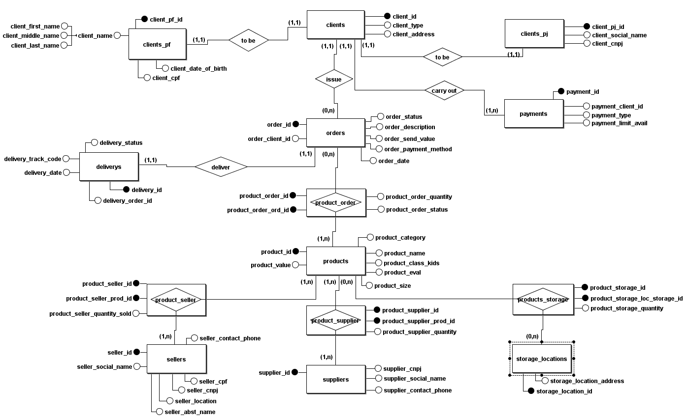
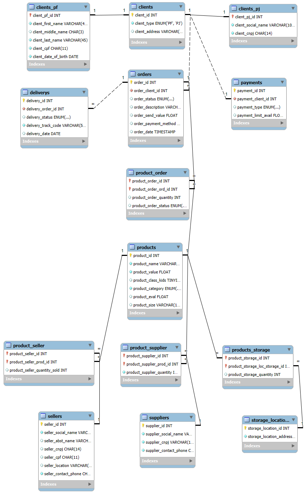

# Banco de Dados para E-commerce_refinado

Esta é uma nova versão do projeto E-commerce com base no anterior contendo novas tabelas e atributos. 
O objetivo continua sendo o mesmo que visa a criação de um banco de dados para armazenamento, organização e consulta de informações conforme proposto no desafio do Bootcamp Potência Tech - iFood. 
Nesta versão do projeto há uma maior padronização das nomenclaturas das tabelas e atributos com o objetivo de facilitar as queries diminuindo a incidência de possíveis redundâcias ou ambiguidades.

## Modelo Conceitual

  

## Modelo Lógico

  

### 🛠️ Tecnologias
As seguintes ferramentas foram utilizadas:

- [brModelo](http://www.sis4.com/brModelo/) utilizada para construção do modelo conceitual.

- [MySQL](https://www.mysql.com/) utilizada para a construção do modelo lógico.

- [VScode](https://code.visualstudio.com/) utilizado para a criação do modelo físico e também para a inserção, manipulação e consulta dos dados.  
OBS: Você deve instalar no seu VScode as extensões SQLTools e SQLTools MySQL/MariaDB/TiDB para que seja possível realizar a conexão de seu VScode com seu MySQL. 
Caso não utilize o VScode pode criar seu modelo físico e Scripts no MySQL Workbench (https://dev.mysql.com/downloads/workbench/).

### 📄 Scripts

- [Script_SQL_E-commerce_refinado](Script_SQL-E-commerce_refinado.sql) 
Este primeiro script foi elaborado para criação do modelo físico do Banco de Dados E-commerce.

- [Inserção_de_dados.sql](Inserção_de_dados.sql) 
Este segundo script foi elaborado com alguns dados para inserção no Banco de Dados a título de teste. 

- [Consultas_BD_E-commerce_refinado.sql](Consultas_BD_E-commerce_refinado.sql) 
Este terceiro script foi elaborado com algumas Queries para que o usuário possa testa-lo através de consultas.